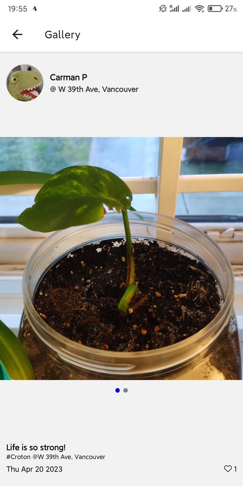
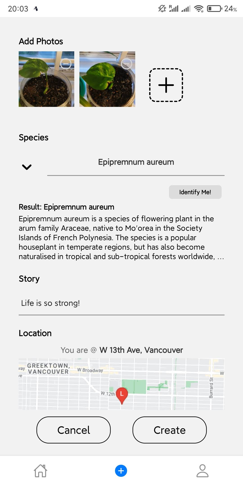

## Plant Diary

### Team

Wai Kin Chu, Siqi Chen, Zhiyuan Yang

### App Description

An app that allows plant lovers to record the growth of plants by taking photos week by week. Users can obtain achievements by sharing diaries, extending the length of a diary, getting likes and followers, or publishing a diary of a unique plant species.

### Functionality

- Authentication：users should sign up/login in to use our app
- Camera use: users can take picture when they want to create/edit diaries
- Location use: app uses user location when user create diaries or choose sort by location in home screen
- Notification: users will receive notification when they create a new diary or there is new follower
- External API use: "Plant.id" api is used in create diary screen, when user upload at least one picture, there is a button "Identify Me!" shown. If user press this button, it will use the last photo uploaded by user to identify the plant species in the photo.

### Demo Video

Demo Video Link: https://youtu.be/VOfUR96cOWk    

### User Interface

Home page, search, and sort by location:

Gallery, user profile, third user profile, and follower/following list:

Subscribed diaries, create diary and select species, and plant identification API :

After create first diary, got achievement and notification:

