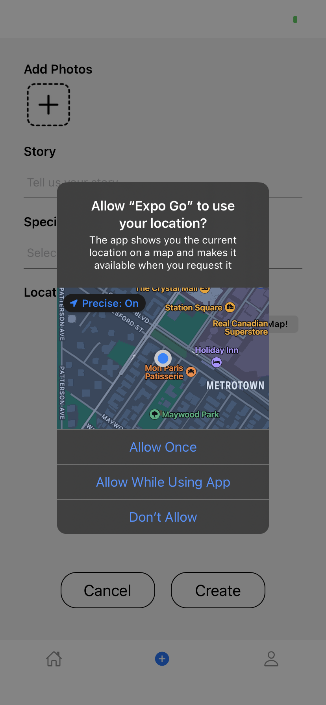

## Plant Diary

#### Team

Wai Kin Chu, Siqi Chen, Zhiyuan Yang

#### App Description

An app that allows plant lovers to record the growth of plants by taking photos week by week. Users can obtain achievements by sharing diaries, extending the length of a diary, getting likes and followers, or publishing a diary of a unique plant species.

  
<b>Iteration 1</b>

### Iteration 1

#### Contributed by member:

- CRUD functions with firebase -- Siqi

  - createDiary(diary)
  - deleteDiary(id)
  - editDiary(id, updateField)
  - getDiaryById(id)
  - getDiaryByUser(id)
  - getDiaryQueueByUser(id)
  - getLatestDiariesQueue()
  - getDiaryByLocation(location)
  - getDiaryBySpecies(species)
  - createProfile(usr)
  - editProfile(id,updateField)
  - getProfileById(uid)
  - getProfileByUid(uid)
  - getFollowerByUser(uid)
  - getFollowingByUser(uid)
  - searchDiaries(keyword)

- Navigation and screens -- Zhiyuan

  - AuthStack
    - Start
    - Login
    - Signup
  - AppStack
    - Diaries
      - Recommend
      - Subscribed
    - Create (Edit)
    - Profile
    - Gallery
    - Follow (Following & Follower)
    - EditProfile

- Components -- Wai Kin
  
  - CardComponent
  - Color
  - DiaryCard
  - GalleryBox
  - Grid
  - Icon
  - InputComponent
  - PressableButton
  - SearchBar
  - UserItem
  - UserList

#### Internal Comments for next iteration 

**Components**
DiaryCard:

- params: {diaries} (e.g.[{diaryId:'23uoi9',author:'lesly',species:'bamboo',date:'2023-03-24',location:'Downtown Vancouver',images:['url1','url2'],likes:4}])
- need border for the card
- align center
- no need for head photo? `bold name` + `@location` + `#species` + `story` (limit the text length)
- like button
- press card will navigate to Gallery screen with params {item:diary}
- what if only one image in a diary

GalleryBox:

- params: {images}

Card:

- might need pre-define some styles e.g. border, border-radius, margin, padding

Grid:

- params: {images, width, column}

Icon:

- params: {url, size}
- witdh = height = border-radius = size

InputComponent / SearchBar

- params: {placeholder, value, onChangeText}
- might not be neccesary
- otherwise add some pre-define params

UserItem:

- params: {user} (e.g.{id:'123iou', name:'john', head:'url', following:true})
- show following status, press button to follow or unfollow
- press item go to Profile screen with {userId:id}

UserList:

- no need, detectly use flatlist in follow screen

**CRUD functions**
Add following function:

- followUser(id)
- unfollowUser(id)
- checkRelation(id)
- like(diaryId) (need another table for like)
- unlike(diaryId)
- checkLike(diaryId)
- getSubscribedDiary()

Other comments:

- all user id are uid
- change the id to uid in getDiaryByUser(uid), editProfile(uid, ...), getProfileById(uid) ...
- after create a diary, add diaryId in to the diaris list in user's profile. (may be no need if directly query the diary by uid)

**Navigation and Screens**

- Add CRUD functions (Done)
- Subscribe update in real time
- Add images and camera function
- How to add multiple images?
- implement the style of screens

**Screenshots**

#### CRUD Demonstration
Create an item by clicking create button in bottomTab:

Read an item by clicking the item in HomeScreen:

Update an item by clicking "Profile" in bottomTab, then click "edit". After updated, click "Confirm"
Back to Home screen to view the update:

Delete the item by clicking "Profile" in bottomTab, then click "edit". Click "Delete". Back to Home screen to view the item is deleted:

  
<b>Iteration 2</b>

#### Iteration 2

#### Contributed by member:

**CRUD Function** -- Siqi
- followUser(id)
- unfollowUser(id)
- checkRelation(id)
- like(diaryId) (need another table for like)
- unlike(diaryId)
- checkLike(diaryId)
- getSubscribedDiary()

**Layout and Styles for Screens and Components and functionalities** -- Zhiyuan
- Home
- Gallery
- Create
- EditProfile
- Profile
- Authentication
- Location use

**Camera use functionalities and corresponding function on storage** -- Wai Kin
- Take Photos using camera
- Pick Images from libraries
- Multiple images upload
- upload and delete images in storage

##### Internal Comments for next iteration
- update layout and style to align the prototype design: Home, Gallery, Create
- implement search function
- implement sort function
- create customized seletion drop-down menu (current module's style is not customizable)
- DiaryCard can only show 3 photos in grid (Done)
- show multiple images in create screen instead of replacing current image when adding (Done)
- show previous uploaded images in edit screen (Done)
- create notification for each diary when create/edit
- explore if there are some external API we can use

**Below functionalities are added in iteration 2, with screenshot provided as below**

#### Authentication
Signup the account, warning if password mismatched. Navigate to home screen if signup is successful:

Login in the account, warn the user if the user account does not exist (No user account in authentication database):

Login by typing the email and password. Warn the user if user inputs incorrect password. 
Navigate to home screen if login is successful(input valid email and correct password):

#### Camera use

Get image by camera by asking if the user can grant the permission, if yes, will use camera to take photos.
Otherwise, will alert the user permission is required:
Press "Take Photo...":

If press "Deny", alert will be poped out.

If press "Allow", camera can be used and photo be added:

Get image from media library by asking if the user can grant the permission, if yes, will get photos from media library.
Otherwise, will alert the user permission is required:
Press "Choose From Library":

If press "Deny", alert will be poped out.

If press "Allow", camera can be used and photo be added:

#### Location use
Get the location using expo-location by asking if the user can grant the permission, if yes, will location from map.
Otherwise, will alert the user permission is required:

If press "Don't allow", alert will be poped out.

If press "Allow Once/Allow While Using App", Location can be obtained by pressing 'Location Me!":

Pressing 'Go to Map!" if we want to change location, after clicking "Confirm your Location", new location will be updated:

**Below functionalities will be added in next iteration**
- Notification
- External API use

